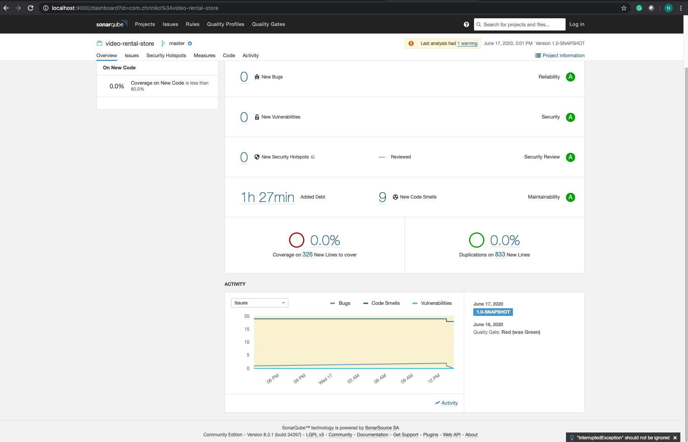

### Video Rental Store

```text

 __   ___    _           ___         _        _   ___ _               
 \ \ / (_)__| |___ ___  | _ \___ _ _| |_ __ _| | / __| |_ ___ _ _ ___ 
  \ V /| / _` / -_) _ \ |   / -_) ' \  _/ _` | | \__ \  _/ _ \ '_/ -_)
   \_/ |_\__,_\___\___/ |_|_\___|_||_\__\__,_|_| |___/\__\___/_| \___|
                                                                      

```

#### Creation Info
* Nikolaos Christidis (nick.christidis@yahoo.com)
* JDK 1.8 used

* Dev Dependencies used:
    * Vertx Core, Web
    * Kryo
    * Guice
    * Postgresql driver
    * Jpa, hibernate, hikaricp, jcache, ehcache
    * Commons pool 2
    * Reflections
    * Log4j, jcabi-log
    * Lombok
    
* Test Dependencies used:
    * Vertx unit, web client
    * Junit, mockito
    * Cucumber java + junit
    * Spring boot starter web (for RestTemplate)
    * JSONAssert

#### Disclaimer for testing
* Due to limited time, I have focused more on the inverted pyramid of testing, therefore, I have written extensively end to end
tests via Cucumber which define the business operations that this service should fulfill rather than writing unit testing with mocking and
integration testing per maven module.

Thanks for the understanding.


#### Business Operations / Capabilities
* Create customer
* Create film
* Create film copy
* Get customer total bonus / detailed
* Rent film copies
* Return film copies
* Get customer's rented film copies [customer --->rented---> film copies]


#### Modules
* [common-infra](common-infra) - [README](common-infra/README.md): has common infrastructure code.
* [domain](domain) - [README](domain/README.md): has the business/domain model and provides persistence capabilities.
* [service](service) - [README](service/README.md): has the service layer of the application, validations, transactions, scaling, etc.
* [resource](resource) - [README](resource/README.md): provides boundaries/endpoints to the outside world via HTTP (REST with JSON)
* [bootstrap](bootstrap) - [README](bootstrap/README.md): starts the whole platform after glues all the above components/modules together
* [e2e-tests](e2e-tests) - [README](e2e-tests/README.md): contains which features this platform implements with the help of Cucumber
* [logging](logging) - [README](logging/README.md): contains the logging configuration for the platform.


#### Infrastructure
* Postgres

    * All the infrastructure is defined in [docker conpose file](docker-compose.yml)
      In order to start the infra, execute: `docker-compose up`


#### Unit Tests
Execute: `mvn clean test`


#### Integration Tests (should have run infrastructure-postgres first)
Execute: `mvn clean install -DskipUTs=true`


#### Run All Tests (should have run infrastructure-postgres first)
Execute: `mvn clean install`


#### Cucumber Reports
In order to generate the reports, navigate to: [e2e-tests](e2e-tests) module, and execute the [RunCucumberTests.java](e2e-tests/src/test/java/com/chriniko/e2e/RunCucumberTests.java) from your IDE.
Then you can see the generated reports by opening on your browser the following file: `target/cucumber-reports/index.html`


#### Sonar Qube
1) First make sure that any running images from [docker-compose.yml](docker-compose.yml) file are stop by executing the command: `docker-compose down`
2) Then execute: `docker-compose -f code-quality.yml up`
3) Execute on root project: `mvn sonar:sonar -Dsonar.host.url=http://localhost:9000`
4) Open the following url on your browser: `http://localhost:9000/dashboard?id=com.chriniko%3Avideo-rental-store`




#### Packaging and Run (Infrastructure is prerequisite)
1) Execute `mvn clean install`
2) Go to: `bootstrap/target`
3) Execute: `java -jar bootstrap-1.0-SNAPSHOT-jar-with-dependencies.jar`

Now you should see logs that hint that the application is up and running


